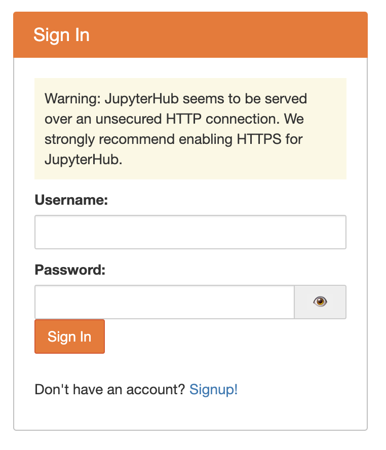

# jupyterhub_script

## How to set a Jupyterhub with Docker

Using offical docker image to Jupyterhub

### Step 1

Run a JupyterHub container

```bash=
docker run -ti -p 8000:8000 --name jupyterhub jupyterhub/jupyterhub bash
```
### Step 2

Bootstrap jupyterhub 

```bash=
curl https://raw.githubusercontent.com/abaywu/jupyterhub_script/main/bootstrap | bash 
```

### Step 3

Create Admin user



Click Signup


Authorization Users

http://127.0.0.1:8000/hub/authorize

## Create a gitpuller link

Use link generator

https://jupyterhub.github.io/nbgitpuller/link